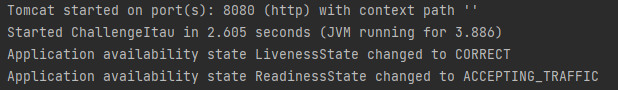
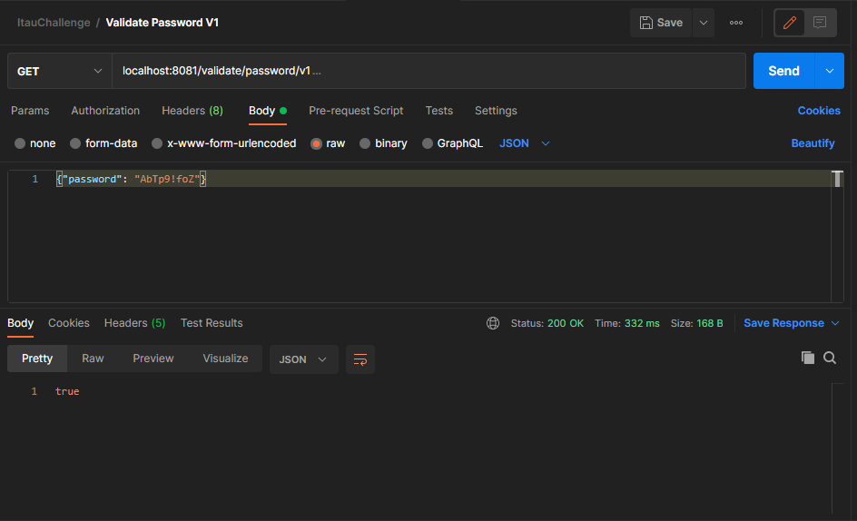
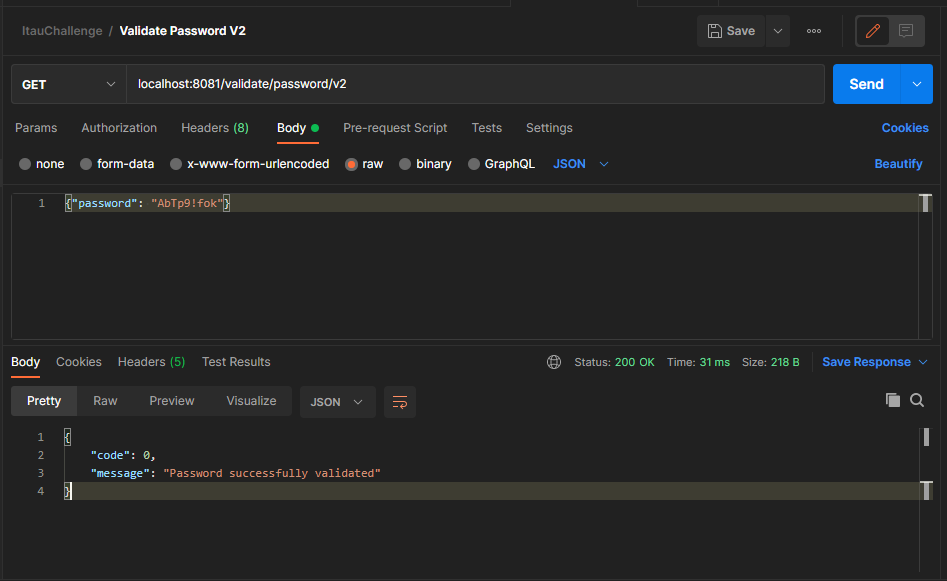
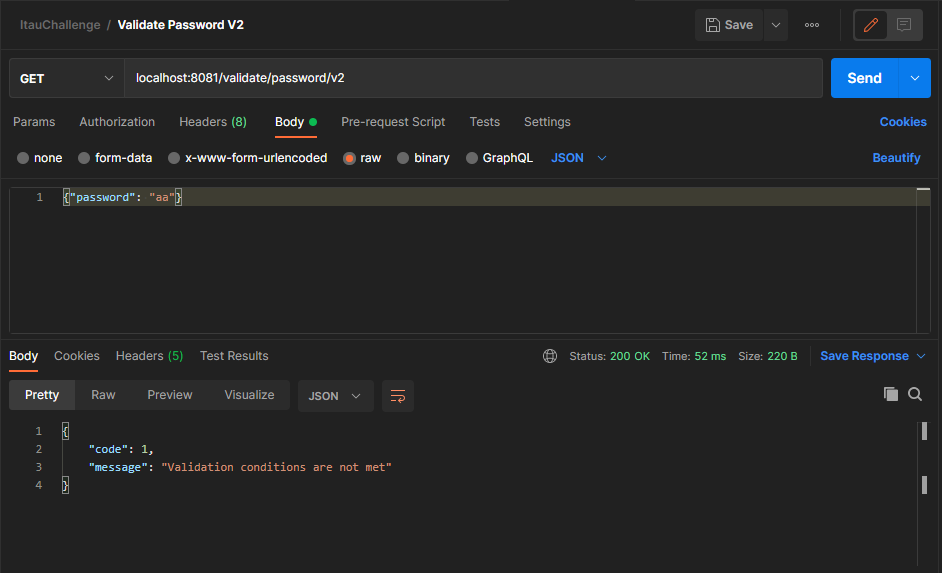
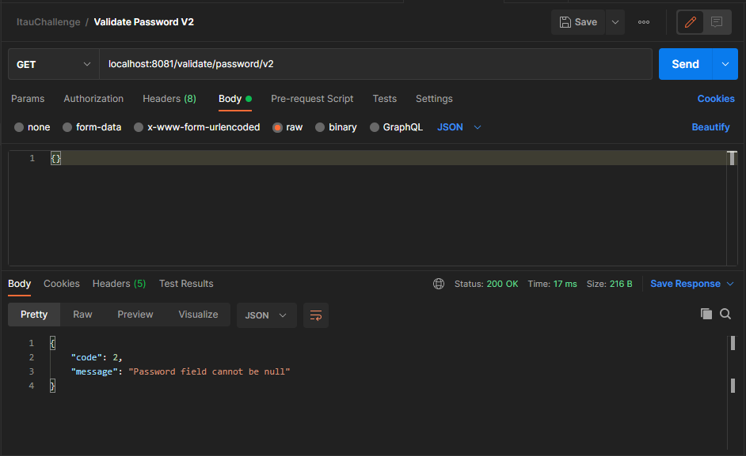

# ChallengeItau

 Desafio técnico Itaú

## 🚀 Começando

Essas instruções permitirão que obtenha uma cópia do projeto em operação na sua máquina local para fins de teste.

### 📋 Pré-requisitos

* Java 11+

* Maven 3.8.1+

* Docker desktop 3.5.2+

* Postman 8.9.1+
```
Link de apoio para instalação  e configurção:
https://medium.com/beelabacademy/configurando-vari%C3%A1veis-de-ambiente-java-home-e-maven-home-no-windows-e-unix-d9461f783c26
https://docs.microsoft.com/pt-br/virtualization/windowscontainers/manage-docker/configure-docker-daemon
```

### 🔧 Instalação

Seguir os seguintes passos para utilização e desenvolvimento do serviço

* Git Clone

```
PROJECT_HOME git clone https://github.com/l1maigor/ChallengeItau.git
```

* Maven Package

```
PROJECT_HOME mvn package
```

* Java -jar

```
PROJECT_HOME:\target\java -jar .\ChallengeItau-0.0.1-SNAPSHOT.jar
```

Após realizados os passos, é esperado o seguinte log:



## ⚙️ Executando os testes

Para testes da aplicação, será utilizado o Postman.
A collection utilizada encontra-se no path : src/main/resources/ItauChallenge.postman_collection.json

Existem duas soluções para o desafio proposto:

1 - Versão 1 (V1):

  * Possui somente um retorno booleano, sendo:
    * true - senha válida;
    * false - senha inválida.
  

<b>Condição true</b>


<b>Condição false</b>


2 - Versão 2 (V2):

  * Retorna um json com código e mensagem amigável, sendo:
    * code - código de procesamento:
      * 0 - Senha validada com sucesso;
      * 1 - Alguma condição dos parâmetros não foi atendida;
      * 2 - O campo senha não foi enviado (nulo);
      * 3 - Exceção não esperada/tratada.

<b>Code 0</b>


<b>Code 1</b>


<b>Code 2</b>


## 📦 Desenvolvimento

Dado ao desafio proposto, tomei a liberdade de inclusão de algumas propostas:

1 - Validação de campo nulo:
  * Na documentação inicial não foi mencionado o tratamento, dessa forma, a aplicação seguirá conforme abaixo:
    * V1 - Retorno false
    * V2 - Retorno code 2
    
2 - Foi criado o resource V2 visando uma atualização na aplicação, assim retornando uma mensagem amigável e código para as requisições, tornando a aplicação preparada para novos ajustes solicitados por usuários.

3 - A aplicação encontra-se também disponível no Docker Hub para pull da image.


## 🛠️ Construído com

Mencione as ferramentas que você usou para criar seu projeto

* [Java 11](https://docs.oracle.com/en/java/javase/11/)
* [Spring Boot](https://docs.spring.io/spring-boot/docs/current/reference/htmlsingle/)
* [Maven](https://maven.apache.org/)

## ✒️ Autor

* **Igor da Silva Lima** - *Desafio Técnico* - [GitHub](https://github.com/l1maigor)